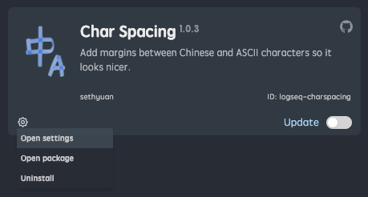
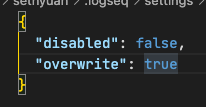

# logseq-plugin-charspacing

在中英文单词间添加一个空格，看起来会更美观一点。

Render an extra space between Chinese and Latin characters to make the document look better.

## 效果展示 (Showcase)

开启插件 (Enabled)：

未开启插件 (Disabled)：

## 模式

- 纯渲染（**默认**）：不影响源文件，也不影响编辑模式。对你的内容无害，就算插件有 bug 也不会导致数据丢失。
- 覆写：直接修改内容。如果插件有 bug (但愿不会) 你的数据*有可能会丢失或出现错误*。

如想开启覆写模式，可参照下图进行设置：

## Mode

- Render (**Default**): This doesn't affect the source file, nor it affects the editing mode. Your data is safe even if there're bugs in the plugin.
- Overwrite: Modifies content directly. _You might lose data_ if there're bugs in the plugin (which I hope not).

You can turn on the Overwrite mode following below illustrations:

