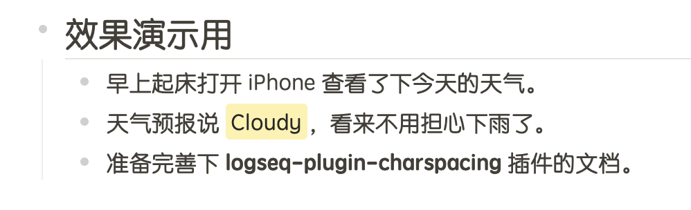
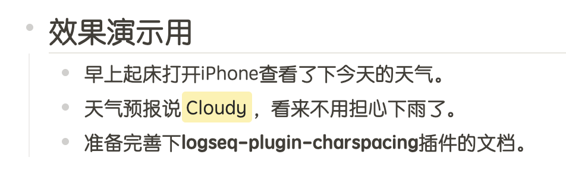

# logseq-plugin-charspacing

在中英文单词间添加一个空格，看起来会更美观一点。不影响源文件，也不影响编辑模式，对你的内容无害。

Render an extra space between Chinese and Latin characters to make the document look better. This doesn't affect the source file, nor it affects the editing mode.

## 效果展示 (Showcase)

开启插件 (Enabled)：

未开启插件 (Disabled)：

